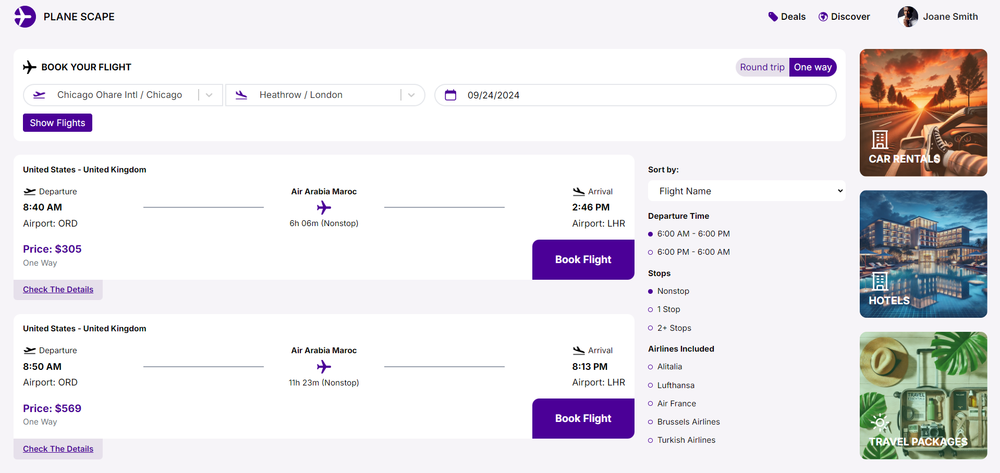
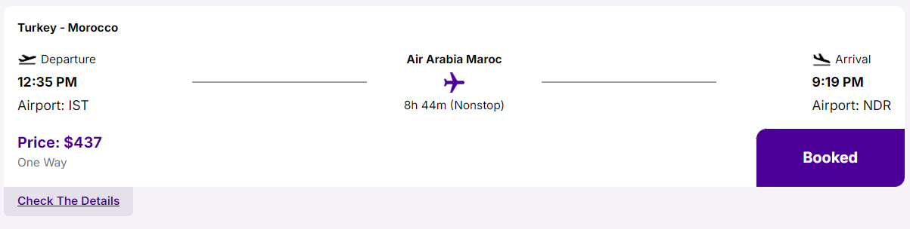
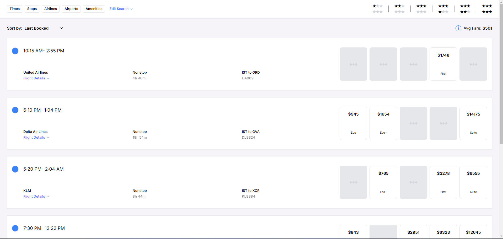
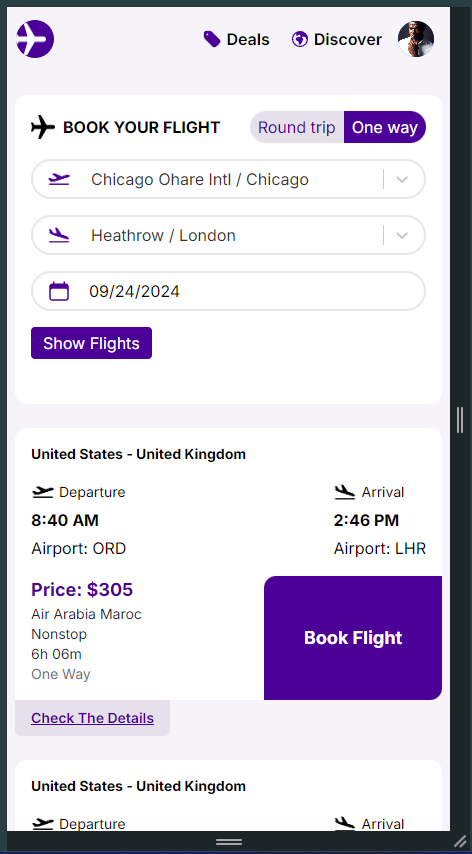

# Fellas Case

Bu proje, Appfellas şirketinin işe alım sürecindeki Proje Geliştirme aşamasıdır.

## Geliştirici: [Ahmet Mustafa Çenberci](https://github.com/acenberci)

### Kurulum
Öncelikle, bilgisayarınızda Node.js ve MongoDB sunucusunun kurulu olması gerekiyor. Ardından, MongoDB yapılandırması için `server/config/config.js` dosyasını kullanabilirsiniz. MongoDB bağlantı URL'sini ise `server` klasörü içerisinde oluşturacağınız `.env` dosyasına aşağıdaki gibi girmeniz gerekiyor:

```bash
PORT= 
MONGO_URI=
```
Ardından, React projesi için bir .env dosyası oluşturmalısınız ve içerisine aşağıdaki değerleri eklemelisiniz:
```bash
REACT_APP_APP_ID= 
REACT_APP_APP_KEY=
```
Son olarak, terminali açarak fellas-case klasörünün içinde sırasıyla aşağıdaki komutları çalıştırmanız yeterlidir;
```bash
npm install
npm start
```
### Uygulamanın Çalışır Hali

Aşağıda uygulamanın arayüzüne ait ekran görüntüleri bulunmaktadır:



